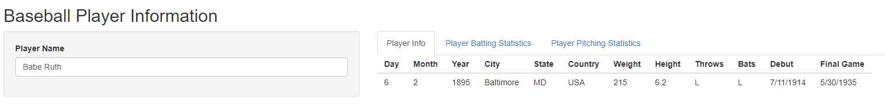
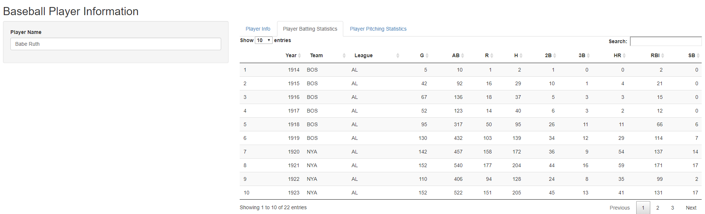
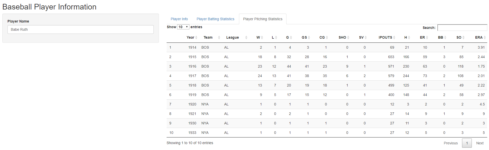

# Baseball Player Information

This Application is designed to  look up baseball player statistics since the year 1870. The app utilizes the [Sean Lahman](http://www.seanlahman.com/baseball-archive/statistics/) dataset and allows an individual to look up the Player Info, Player Batting Statistics, and the Player Pitching Statistics. 

---

### Baseball Player Information

+ The user simply enters in the name of a Baseball Player (legal name) and the app automatically returns the player's information. 

### Batting Statistics

+ The app retrieves the batting statistics for the particular player and allows the user to search the statistics through an interactive table. 

---

### Pitching Statistics

+ The app retrieves the pitching statistics for the particular player and allows the user to search the statistics through an interactive table. 

